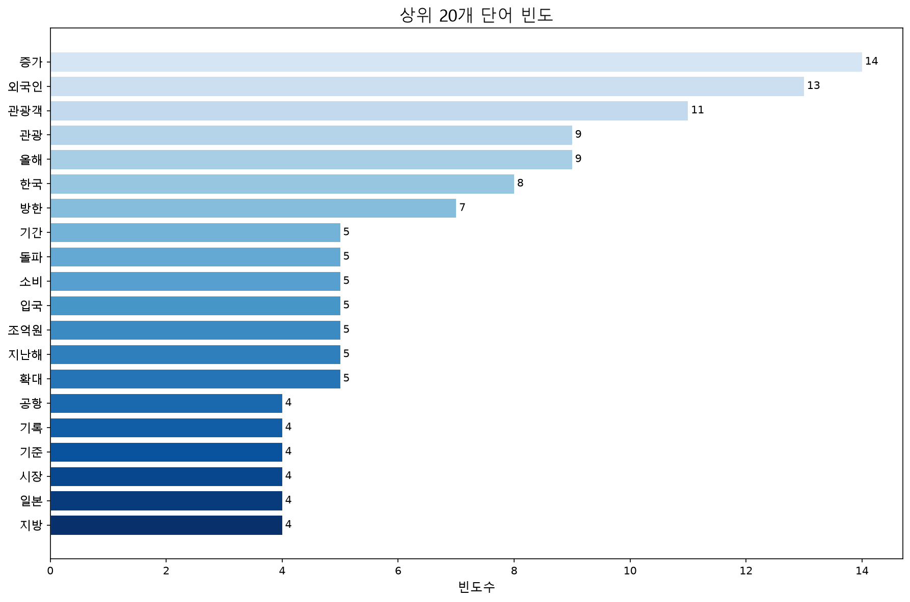

# 📰 네이버 뉴스 헤드라인 텍스트 분석 보고서

> **생성 일시:** 2026-06-24 23:09:56  
> **분석 도구:** KoNLPy (Okt) · PyTorch · WordCloud · BeautifulSoup4

---

## 1. 수집 기사 정보

| 항목 | 내용 |
|------|------|
| **제목** | “올해 유독 외국인 관광객 많네” 진짜였다…한국서 쓴 돈도 ‘역대 최대’ |
| **출처** | [네이버 뉴스 IT/과학](https://n.news.naver.com/mnews/article/011/0004634432) |
| **본문 미리보기** | 지난달 13일 서울 중구 명동거리에서 외국인들이 관광을 하고 있다. 뉴스1 올해 한국을 찾은 외국인 관광객 수가 상반기가 끝나기도 전에 1000만명을 넘어섰다. 지난해보다 약 한 달 빠른 속도로 1000만명 고지에 오른 것으로 K팝과 K콘텐츠를 중심으로 한 한국 관광 … |

---

## 2. 텍스트 수집 및 정제

| 구분 | 값 |
|------|----|
| 원본 텍스트 길이 | 1,916자 |
| 정제 후 텍스트 길이 | 1,695자 |
| 제거된 문자 수 | 221자 |
| 정제 방식 | 한글 자모·완성형 외 문자 제거, 중복 공백 정리 |

---

## 3. 형태소 분석 결과

- **형태소 분석기:** KoNLPy `Okt`
- **추출 기준:** 명사(nouns) · 2글자 이상 · 불용어 제거
- **추출된 명사 토큰 수:** 314개
- **고유 단어 수:** 167개
- **평균 단어 빈도:** 1.88회

---

## 4. 단어 빈도 계산 (PyTorch Tensor)

```
단어 → 정수 ID 매핑
  ↓ torch.tensor() 변환
  ↓ torch.bincount() 집계
  ↓ 빈도 딕셔너리 역변환
```

- 상위 20개 단어의 총 등장 횟수: **130회** (전체의 **41.4%**)

---

## 5. 워드클라우드


---

## 6. 상위 20개 단어 빈도



### 상세 데이터

| 순위 | 단어 | 빈도 | 시각화 |
|:----:|------|:----:|--------|
| 1 | 증가 | 14 | ██████████████ |
| 2 | 외국인 | 13 | █████████████ |
| 3 | 관광객 | 11 | ███████████ |
| 4 | 관광 | 9 | █████████ |
| 5 | 올해 | 9 | █████████ |
| 6 | 한국 | 8 | ████████ |
| 7 | 방한 | 7 | ███████ |
| 8 | 기간 | 5 | █████ |
| 9 | 돌파 | 5 | █████ |
| 10 | 소비 | 5 | █████ |
| 11 | 입국 | 5 | █████ |
| 12 | 조억원 | 5 | █████ |
| 13 | 지난해 | 5 | █████ |
| 14 | 확대 | 5 | █████ |
| 15 | 공항 | 4 | ████ |
| 16 | 기록 | 4 | ████ |
| 17 | 기준 | 4 | ████ |
| 18 | 시장 | 4 | ████ |
| 19 | 일본 | 4 | ████ |
| 20 | 지방 | 4 | ████ |

---

## 7. 종합 해석

분석된 기사에서 가장 많이 등장한 단어는 **증가**, **외국인**, **관광객** 등으로,  
해당 기사는 주로 `증가 / 외국인 / 관광객` 관련 주제를 다루고 있습니다.

전체 **167개** 고유 명사 중 상위 **20개**가 전체 빈도의 <b>41.4%</b>를 차지하여,  
텍스트의 핵심 주제가 비교적 분산되어 있음을 확인할 수 있습니다.

---

*본 보고서는 자동 생성되었습니다.*